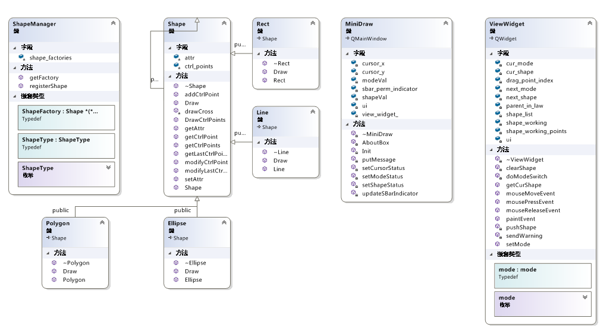

# MiniDraw 实验报告

刘紫檀 PB17000232

## 实现的功能

- 画线、矩形、椭圆、徒手画、多边形
- 顶点编辑
- 工具栏和当前模式、图形的提示

还没实现的功能：

- Help
- Drag Whole（图形整体平移工具）

## 使用说明

目前实现了四种模式：`View`模式，`Add Shape` 模式， `Drag Point` 模式和 `RAW` 模式。

- `View` 模式可以观察不带控制点的图形
- `Add Shape` 模式可以添加线、矩形、椭圆、多边形
  - 左键选择点，右键闭合当前图形并且开启下一个图形（特别为多边形设计）
- `RAW` 模式可以添加徒手画
  - 按住左键就可以画，松开就停止
- `Drag Point` 模式可以修改以上所有图形的控制点
  - 按住左键拖动

下方的控制条会提示当前所处的模式。

当图形没有画完而用户点击对应模式/图形时，模式/图形改变将会在该图形绘制完毕后生效。

## 程序设计

我的实现中包含的类见上图。下面简略介绍设计思想与亮点：

1. 实现 `Shape` 和 `ViewWidget`（画板）的解耦

   - `ViewWidget` 通过 `ShapeManager` 获得对应类型的工厂方法，进行调用后得到对应的 Shape 子类实例

   - 加入新的 `Shape` 只需要继承 `Shape` ，修改 UI（`minidraw.ui`）并加入 `connect` 语句，并在 `shape_factories` 这个静态变量的初始化列表中添加对应的类型和 lambda 函数（作为工厂方法）即可，**不需要**改动 `ViewWidget`
   
2. 让 `Shape` 结构合理

   - 加入 Attribute 机制，实现画板和 `Shape` 之间简单状态变量的交换 
   
   - 内部存储全部控制点信息，而控制点的解释交给 `Shape` 的子类进行处理
   
     同时封装了全部需要的控制点操作，包括拖动时的操作
   
3. 利用状态栏，通知用户状态和提示信息，增强友好度
   
4. 对 `menuBar` 的操作放到 UI 文件中，简化设计

更详细的内容可以参考源码中的注释，在此不再赘述。

​     