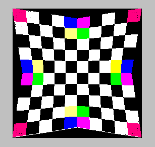
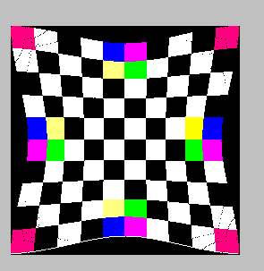
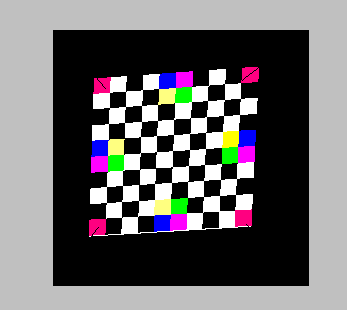

# ImageWraper 实验报告

刘紫檀 PB17000232

## 原理

> 关于详细的计算过程可以运行下面的 Maxima 脚本：(比如，保存成 .mac 文件然后用 wxMaxima 运行)
>
> ```
> /* [wxMaxima: title   start ]
> RBF and IDW Calculations
>    [wxMaxima: title   end   ] */
> 
> 
> /* [wxMaxima: section start ]
> RBF Least Square Approximation
>    [wxMaxima: section end   ] */
> 
> 
> lse_eqn: (m_[11]*p_[ix]+m_[12]*p_[iy]+b_[x]-q_[ix])^2+(m_[21]*p_[ix]+m_[22]*p_[iy]+b_[y]-q_[iy])^2;
> 
> expand(lse_eqn);
> 
> rbf_m11: expand(diff(lse_eqn, m_[11]));
> factor(ratcoef(rbf_m11, m_[11]));
> factor(ratcoef(rbf_m11, m_[12]));
> factor(ratcoef(rbf_m11, b_[x]));
> factor(ratcoef(ratcoef(ratcoef(rbf_m11, m_[11], 0), m_[12], 0),b_[x], 0));
> 
> rbf_m12: expand(diff(lse_eqn, m_[12]));
> factor(ratcoef(rbf_m12, m_[11]));
> factor(ratcoef(rbf_m12, m_[12]));
> factor(ratcoef(rbf_m12, b_[x]));
> factor(ratcoef(ratcoef(ratcoef(rbf_m12, m_[11], 0), m_[12], 0),b_[x], 0));
> 
> rbf_m21: expand(diff(lse_eqn, m_[21]));
> factor(ratcoef(rbf_m21, m_[21]));
> factor(ratcoef(rbf_m21, m_[22]));
> factor(ratcoef(rbf_m21, b_[y]));
> factor(ratcoef(ratcoef(ratcoef(rbf_m21, m_[21], 0), m_[22], 0),b_[y], 0));
> 
> rbf_m22: expand(diff(lse_eqn, m_[22]));
> factor(ratcoef(rbf_m22, m_[21]));
> factor(ratcoef(rbf_m22, m_[22]));
> factor(ratcoef(rbf_m22, b_[y]));
> factor(ratcoef(ratcoef(ratcoef(rbf_m22, m_[21], 0), m_[22], 0),b_[y], 0));
> 
> rbf_bx: expand(diff(lse_eqn, b_[x]));
> rbf_by: expand(diff(lse_eqn, b_[y]));
> 
> /* linsolve([sum(rbf_m11,i,1,n), sum(rbf_m12,i,1,n), sum(rbf_m21,i,1,n), sum(rbf_m22,i,1,n), sum(rbf_bx,i,1,n), sum(rbf_by,i,1,n)], [m_[11], m_[12], m_[21], m_[22], b_[x], b_[y]]);
> (This won't work..) */
> 
> /* [wxMaxima: section start ]
> IDW Linear Equations
>    [wxMaxima: section end   ] */
> 
> 
> idw_energy: σ[i]*((t_[11]*(p_[jx]-p_[ix])+t_[12]*(p_[jy]-p_[iy])-(q_[jx]-q_[ix]))^2+(t_[21]*(p_[jx]-p_[ix])+t_[22]*(p_[jy]-p_[iy])-(q_[jy]-q_[iy]))^2);
> 
> expand(idw_energy);
> 
> idw_t11: diff(idw_energy, t_[11]);
> factor(ratcoef(idw_t11, t_[11]));
> factor(ratcoef(idw_t11, t_[12]));
> factor(ratcoef(ratcoef(idw_t11, t_[11], 0), t_[12], 0));
> 
> idw_t12: diff(idw_energy, t_[12]);
> factor(ratcoef(idw_t12, t_[11]));
> factor(ratcoef(idw_t12, t_[12]));
> factor(ratcoef(ratcoef(idw_t12, t_[11], 0), t_[12], 0));
> 
> idw_t21: diff(idw_energy, t_[21]);
> factor(ratcoef(idw_t21, t_[21]));
> factor(ratcoef(idw_t21, t_[22]));
> factor(ratcoef(ratcoef(idw_t21, t_[21], 0), t_[22], 0));
> 
> idw_t22: diff(idw_energy, t_[22]);
> factor(ratcoef(idw_t22, t_[21]));
> factor(ratcoef(idw_t22, t_[22]));
> factor(ratcoef(ratcoef(idw_t22, t_[21], 0), t_[22], 0));
> ```

### IDW

Inverse distance-weighted 插值方法通过计算下式进行插值：
$$
\pmb{f}(\pmb{p})=\sum w_i(\pmb{p})\pmb{f}_i(\pmb{p})
$$
$\pmb{f}_i(\pmb{p})$ 是局域项，其中

$$
w_i(\pmb{p})=\frac{\sigma_i(\pmb{p})}{\sum \sigma_j(\pmb{p})}
$$

$$
\sigma_i(\pmb{p})=\frac{1}{\|\pmb{p}-\pmb{p_i}\|^u}
$$

我的实现中采用 $ u = 2 $。

论文中使用了一次的局域项
$$
\pmb f_i( \pmb p)= \pmb q_i+ \pmb T_i(  \pmb p- \pmb p_i)
$$
并且优化目标是让这个式子
$$
E_i(\mathbf{T}) = \sum^n_{j=1,j \ne i} \mathbf{\sigma_i} (\mathbf{p}_j) \left\| \mathbf{q}_i+ \begin{pmatrix} t_{11} & t_{12} \\ t_{21} & t_{22}  \end{pmatrix} (\mathbf{p}_j - \mathbf{p}_i) - \mathbf{q}_j \right\|^2
$$
最小。此时我们可以让 $ E_i(\bf{T}) $ 关于 $ \bf T $  求导，首先整理 $ E_i(\mathbf{T}) $：
$$
E_i(\mathbf{T}) = \sum^n_{j=1,j \ne i} {{\sigma }_i}\, \left( {{\left( -{q_{\mathit{jy}}}+{t_{22}}\, \left( {p_{\mathit{jy}}}-{p_{\mathit{iy}}}\right) +{t_{21}}\, \left( {p_{\mathit{jx}}}-{p_{\mathit{ix}}}\right) +{q_{\mathit{iy}}}\right) }^{2}}+\\{{\left( {t_{12}}\, \left( {p_{\mathit{jy}}}-{p_{\mathit{iy}}}\right) -{q_{\mathit{jx}}}+{t_{11}}\, \left( {p_{\mathit{jx}}}-{p_{\mathit{ix}}}\right) +{q_{\mathit{ix}}}\right) }^{2}}\right)
$$
分别对 $ t_{11}, t_{12}, t_{21}, t_{22} $ 求导，并让其为0，得到四个方程组：
$$
\sum^n_{j=1,j \ne i} ({{\sigma }_i}\, \left( {p_{\mathit{jx}}}-{p_{\mathit{ix}}}\right) \, \left( {t_{12}}\, \left( {p_{\mathit{jy}}}-{p_{\mathit{iy}}}\right) -{q_{\mathit{jx}}}+{t_{11}}\, \left( {p_{\mathit{jx}}}-{p_{\mathit{ix}}}\right) +{q_{\mathit{ix}}}\right) )= 0 \\
\sum^n_{j=1,j \ne i} (2 {{\sigma }_i}\, \left( {p_{\mathit{jy}}}-{p_{\mathit{iy}}}\right) \, \left( {t_{12}}\, \left( {p_{\mathit{jy}}}-{p_{\mathit{iy}}}\right) -{q_{\mathit{jx}}}+{t_{11}}\, \left( {p_{\mathit{jx}}}-{p_{\mathit{ix}}}\right) +{q_{\mathit{ix}}}\right)  )=0\\
\sum^n_{j=1,j \ne i} (2 {{\sigma }_i}\, \left( {p_{\mathit{jx}}}-{p_{\mathit{ix}}}\right) \, \left( -{q_{\mathit{jy}}}+{t_{22}}\, \left( {p_{\mathit{jy}}}-{p_{\mathit{iy}}}\right) +{t_{21}}\, \left( {p_{\mathit{jx}}}-{p_{\mathit{ix}}}\right) +{q_{\mathit{iy}}}\right)   )= 0 \\
\sum^n_{j=1,j \ne i} (2 {{\sigma }_i}\, \left( {p_{\mathit{jy}}}-{p_{\mathit{iy}}}\right) \, \left( -{q_{\mathit{jy}}}+{t_{22}}\, \left( {p_{\mathit{jy}}}-{p_{\mathit{iy}}}\right) +{t_{21}}\, \left( {p_{\mathit{jx}}}-{p_{\mathit{ix}}}\right) +{q_{\mathit{iy}}}\right) )= 0
$$
联立即可得到解。每个 $ i $ 对应着一个矩阵 $ \mathrm{T} $。


### RBF

$$
\pmb{f}(\pmb{p})=\sum {\bf a}_i R(d)+ {\bf A} \pmb p + {\bf a}
$$

其中

$$
R(d)=(d^2+r^2)^{\mu/2}
$$
这里我的实现采用 $ r = 0, \mu = 1 $，并记此函数为 $ g $，记仿射矩阵 $ \mathbf{A} $ 为 $ \mathbf{M} $，$ a $ 为 $ \mathbf b$。

RBF 首先计算仿射项 $ \mathbf{M} $ 和 $ \mathbf b$，对大于 3 个点的情况，采用最小二乘法近似，即求下式的最小值：
$$
\sum_{i=1}^n ({{\left( {b_y}-{q_{\mathit{iy}}}+{m_{22}}\, {p_{\mathit{iy}}}+{m_{21}}\, {p_{\mathit{ix}}}\right) }^{2}}+{{\left( {b_x}+{m_{12}}\, {p_{\mathit{iy}}}-{q_{\mathit{ix}}}+{m_{11}}\, {p_{\mathit{ix}}}\right) }^{2}})
$$
此约束可以转化为六个偏导数，得到六个方程：
$$
\sum_{i=1}^n (2 {p_{\mathit{ix}}}\, {b_x}+2 {m_{12}}\, {p_{\mathit{ix}}}\, {p_{\mathit{iy}}}-2 {p_{\mathit{ix}}}\, {q_{\mathit{ix}}}+2 {m_{11}}\, {{p}_{\mathit{ix}}^{2}}) = 0 \\
\sum_{i=1}^n (2 {p_{\mathit{iy}}}\, {b_x}+2 {m_{12}}\, {{p}_{\mathit{iy}}^{2}}-2 {q_{\mathit{ix}}}\, {p_{\mathit{iy}}}+2 {m_{11}}\, {p_{\mathit{ix}}}\, {p_{\mathit{iy}}}) = 0 \\
\sum_{i=1}^n (2 {p_{\mathit{ix}}}\, {b_y}-2 {p_{\mathit{ix}}}\, {q_{\mathit{iy}}}+2 {m_{22}}\, {p_{\mathit{ix}}}\, {p_{\mathit{iy}}}+2 {m_{21}}\, {{p}_{\mathit{ix}}^{2}} ) = 0 \\
\sum_{i=1}^n (2 {p_{\mathit{iy}}}\, {b_y}-2 {p_{\mathit{iy}}}\, {q_{\mathit{iy}}}+2 {m_{22}}\, {{p}_{\mathit{iy}}^{2}}+2 {m_{21}}\, {p_{\mathit{ix}}}\, {p_{\mathit{iy}}}) = 0 \\
\sum_{i=1}^n (2 {b_x}+2 {m_{12}}\, {p_{\mathit{iy}}}-2 {q_{\mathit{ix}}}+2 {m_{11}}\, {p_{\mathit{ix}}}) = 0 \\
\sum_{i=1}^n (2 {b_y}-2 {q_{\mathit{iy}}}+2 {m_{22}}\, {p_{\mathit{iy}}}+2 {m_{21}}\, {p_{\mathit{ix}}}) = 0
$$
则可以解出 $ m_{11}, m_{12}, m_{21}, m_{22}, b_x, b_y $。之后再用 N 个点的 $ f({\bf p}_i) = {\bf q}_i $ 约束，共 2N 个方程联立，得到 N 个 $ a_{ix} $ 和  $ a_{iy} $ 的值。

## 实现

### 多态部分

采用 `IDWWarper` 和 `RBFWarper` 两个类，每个类中有方法 `initialize` 和 `doWarp`。出于性能的考虑没有使用基类+虚函数的方法实现接口，而是直接用模板套在 Wrap 上面，用一个 `template <typename Warper> void doWarp(void)` 函数来进行两种代码的复用。

### Known Bugs

1. 没有实现 $ \lt 4 $ 个点的 Warping （对于 RBF 会抛异常）
2. 在 MSVC 下有小概率出现 `Run-Time Check Failure #2 - Stack around the variable 'w' was corrupted`
   - 尝试注释掉了全部我写的代码，没啥效果
   - 直到我把 mainwindow 中的修改也注释掉...
   - 限于精力没法继续搞了，在 Linux 下是正常的
     - 当然，也可能不正常但我没发现，毕竟我没跑 Address Sanitizer...

## 运行截图

### RBF + 8 Debug Dots



### IDW + 8 Debug Dots



### Play with IDW 



（往中心拖动的结果）

