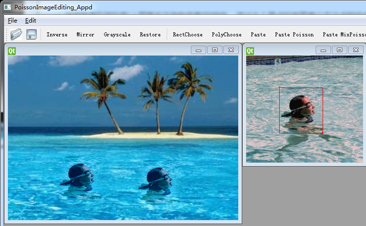
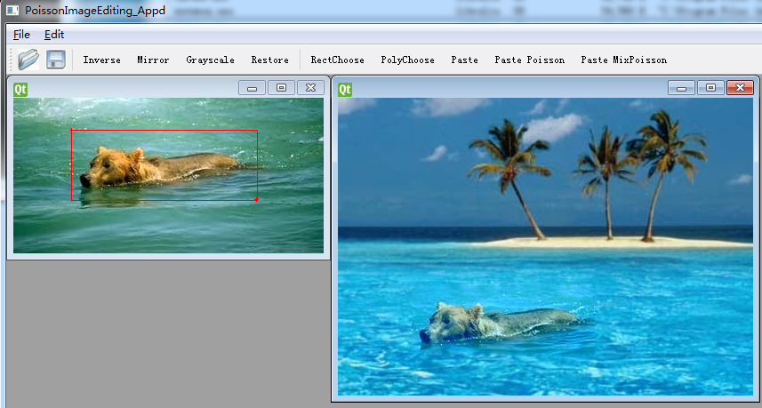
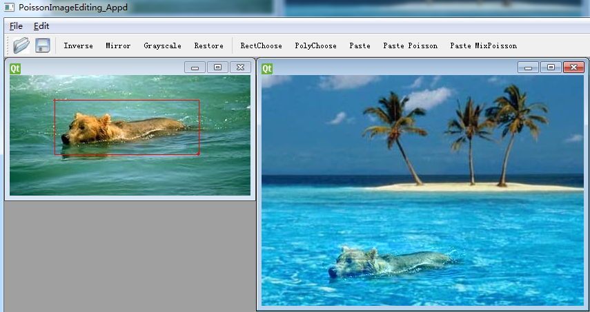
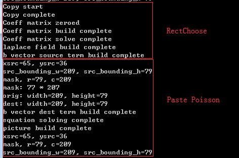
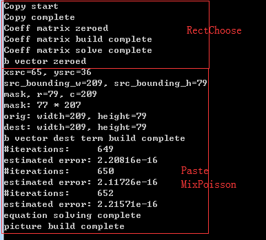
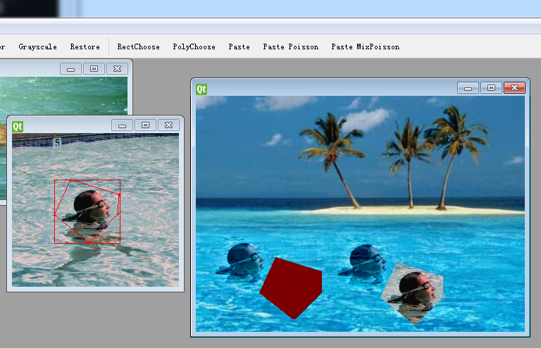

# ImageWraper 实验报告

刘紫檀 PB17000232

## 原理

### Poisson

Poisson 编辑图像利用的是“人眼更关注导数信息”的特性。通过此 5 格点的有限差分方法求解给定目标图片边界情况下的 Poisson 方程来进行插值，以得到“无缝图像”。此处不再赘述 Poisson 的有限差分推导。

处理多边形可以通过一个 mask 矩阵来进行，在多边形内部区域填 1，外部区域填 0。代码中通过宏 `IS_EXTERIOR` 和 `IS_INNER_OR_BOUNDARY_AND_WITHIN_RANGE` 来具体判断到底处于内部还是外部。

> 边界是这样处理的：在一个 5-stencil 的情况下，center 一定是内部点，但是如果此时检测到其四周有不在 maks 中的点，则取对应的边界值，否则对应未知数系数为 1（即取对应未知数的值）

计算此线性方程组采用共轭梯度法，采用上三角。选择此方法的原因是 2D Poisson 问题的矩阵是对称正定的，且比较稀疏。

> 关于此系数矩阵的性质可以参照 http://fischerp.cs.illinois.edu/tam470/refs/poisson2d_notes.pdf ，比较有用。
>
> ~~如果不好好利用对称正定性质而用 QR 分解，就会体会到什么叫天荒地老~~

在计算时，R，G，B 三个通道要求解三次，但是系数矩阵不需要额外变化。此时，预分解带来的状态信息可以重用。

Mixing Gradients 的操作与此类似，不再赘述。

## 实现

### 完成的功能

1. Poisson 和 MixPoisson
2. OpenCV 的使用
   - 利用 fillPoly 函数填充 mask

### 实现亮点

- 重用了 MiniDraw 时的 Shape 系统，并加入了新的功能

### BUGS

1. 系数矩阵构造的速度比较感人

   - 应该是访存的局域性问题，但是没有时间调试了
     - 重写 mask 环节至少可以提速一倍，并且下三角没必要构造，提速一倍
   - ~~VTune 就装了四个小时~~

2. 没有一个很好的等待提示，看起来就是应用假死了

   - 这个应该单开一个线程来进行后台计算，但是也来不及搞了

     （拖 ddl 的后果，躺平

3. 没有实现扫描线算法
   - 这个也没有时间了...
4. 多边形 Poisson 时会出问题（见下面“效果”）
5. 不确定还有没有别的 bug（小声

## 效果

上图为测试图片的效果。左：Poisson；右：MixPoisson。

上图为狗狗图片的 Poisson 测试结果。

上图为狗狗图片的 MixPoisson 测试结果。可以看到，其能同时反映两个图片的变化。

上图为构造 Poisson 过程的日志。

上图为构造 MixPoisson 过程的日志。

上图为多边形进行 MixPoisson，Poisson，MixPoisson 和普通 Paste 的情形。

> Poisson 处的 bug 是因为 laplace field 预初始化时值的错误。
>
> 改成类似 MixPoisson 的形式即可。
>
> 由于时间不够，而没有进行修正。