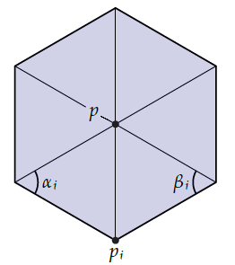
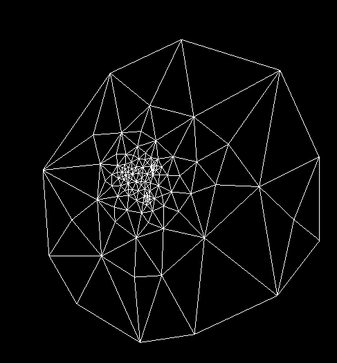
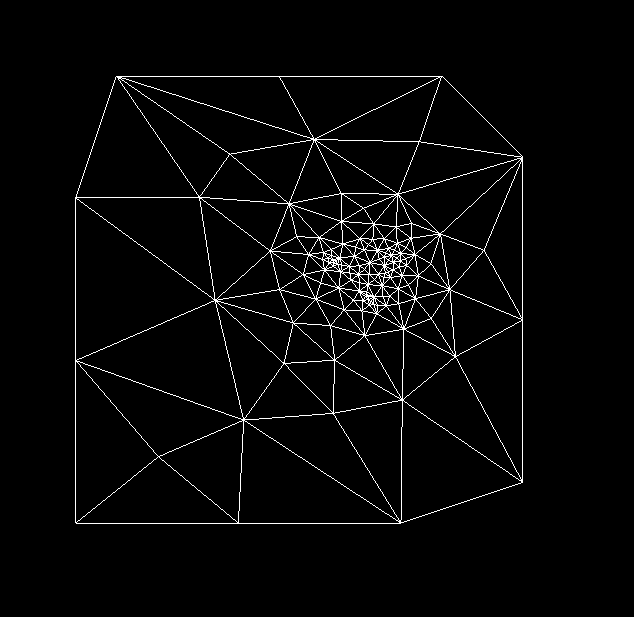
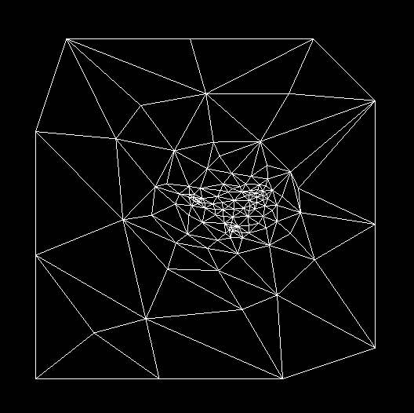
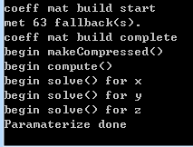
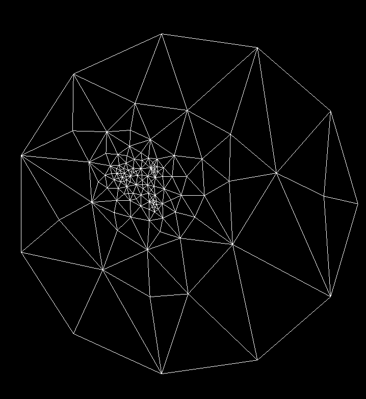
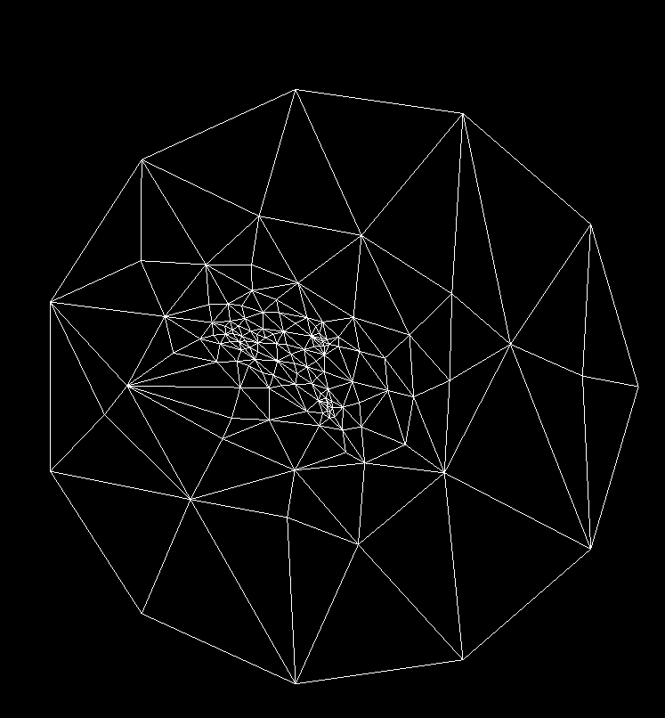

# 作业4 极小曲面与参数化

刘紫檀 PB17000232

## 原理

### 极小曲面

极小曲面的目标是让
$$
\delta_i = v_i - \frac{1}{d_i} \sum_{v \in N(v_i)} (v) = 0
$$
在给定 Dirichlet 边界条件的情况下成立。

此时，我们可以 $ N(v_i) $ 中的点分为边界点和内点，边界点移到方程右侧（因为已经给定），内点在左侧（作为未知数）。让 $ i $ 遍历所有内点，这样的方程的数目恰好为内点的数目，未知数也是如此。

进一步，我们发现系数矩阵为一个主对角占优矩阵，这样的系数矩阵特征值一定不为 0，则方程一定有唯一解。

### 参数化

参数化的核心有二：固定边界和选择权重。

固定边界方面，最简单的做法是把边界点均匀的放置在 1x1 的矩形或是 r = 1 的圆周上。本实现采用此方案。

选择权重方面，把极小曲面的式子写成一个“权重”的形式，我们有
$$
w_{ii} v_i + \sum_{j \ne i} w_{ij} v_j = 0
$$

其中，（$ E $ 为图的边集合）
$$
w_{ij}=\left\{\begin{array}{l}
<0 & (i,j)\in E\\
-\sum_{j\neq i} w_{ij} & (i,i)\\
0 & \text{otherwise}
\end{array}
\right.
$$

#### Uniform Weight

这就是 $ w_{ij} = - 1 (i \ne j) $ 的情况，此时和极小曲面的方程只是同乘一个常数而已，所以其实是一模一样的。

#### Cotangent Weight

$$
 w_{ij} = - (\cot \alpha + \cot \beta), i \ne j
$$

其中 $ \alpha $ 和 $ \beta $ 如图。此实现有个显然的问题，就是 $ w_{ij} $ 可能变成正值。此情况发生时，我的处理是对此顶点 $ v_i $ fallback 到 Uniform Weight 来处理。

## 特性 & BUGS

- 实现了 2x2 共四种参数化
- 实现了极小曲面
- 没有实现纹理，因为在修 Shader
  - 是 PRNG 的 ERROR，但是去掉之后 glLinkProgram 还是会直接爆炸

## 效果

因为图太多了，所以只截取了猫猫头..

#### 猫猫头

上图为 Minimize Surface。

上图为 Square, Uniform 的参数化。

上图为 Square，Cotangent 的参数化。日志如下：

可以看到有 63 个点 fallback。

上图为 Circle，Uniform 的参数化。

上图为 Circle，Cotangent 的参数化。