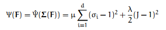
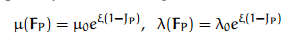

# 作业 7 Taichi 模拟系统

刘紫檀 PB17000232

## 探究

### particle 分布
首先，我们可以考虑圆内的均匀分布：

$$
\left\{
    \begin{eqnarray}
        x = r^2 \cos \theta \\
        y = r^2 \sin \theta 
    \end{eqnarray}
\right.
$$

其中 $ r $ 和 $ \theta $ 均为均匀分布。

> 证明这样产生的分布是均匀的也非常简单，只要考虑其 $ g: (r, \theta) \rightarrow (x,y) $ 变换的雅可比行列式即可。
> 此行列式计算可得为 2，则由于 $ (r, \theta) $ 的概率密度是常数，可知 $ (x,y) $ 的概率密度也为常数。

我们只需要修改 particle 初始化的代码即可实现我们的更改，修改如下：

```c++
Vec gen_round() { // generate evenly distributed point in a circle with r = 1
  auto r = taichi::rand();
  auto theta = taichi::rand() * 2 * 3.14;
  return Vector2(std::array<taichi::real, 2>{
      (real)(std::sqrt(r) * std::cos(theta))
    , (real)(std::sqrt(r) * std::sin(theta))});
}

// Seed particles with position and color
void add_object(Vec center, int c) {
  // Randomly sample 1000 particles in the square
  for (int i = 0; i < 1000; i++) {
    particles.push_back(Particle(gen_round()*0.05f + center, c));
  }
}
```

### MPM

> 1. 下面文字依据 http://mpm.graphics 所述教程总结而成（即参考文献 2）。下文所指“教程“均为此。
>
> 2. 下面文字所用符号均和教程保持一致。
>
>    由于没学过连续介质力学，那些中文翻译是我对着（参考文献 1 ）网上的 ppt 自己搞的，不一定 100% 正确。

#### 原理

MPM 方法里面，每次迭代需要更新每个粒子的速度，而此速度由每个粒子所受的力决定。

MPM 方法中：

1. 用 APIC 方法将粒子的动量更新到网格 `grid`。

   此处的动量是加上了利用上一步的形变矩阵 $ \mathrm {F}$ （即从参考构型变换到真实构型中的局域形变，参考教程中的等式 6）和体积 $ \mathrm {|F|}$计算得到的第一类 Piola-Kirchoff 应力 $ \mathrm{P} $（first Piola-Kirchoff strain，名义应力，即在参考构型中的应力，其是在物体变形前的参考构型中的单位面积上受到的力） 的结果。

   第一类 P-K 应力用之前要转换成 Cauchy 应力，转换的方法其实就是进行教程中的”拉格朗日视角“到”欧拉视角“的转换，见 Section 5.3。

   而 $ \mathrm{P} $ 是对应变能密度函数 $ \mathrm{\Psi} $（strain energy density function）求导得到的，下面会具体分析此函数的形式。

   更新到 `grid` 的过程中，`grid[0]` 和 `grid[1]` 存放此网格的动量，`grid[2]` 存放此网格的质量。

   更新到网格的过程中，插值函数的形式类似 FEM 中的 shape function。

2. 在 `grid` 遍历过程中加上此时间内网格受力对应的冲量

   这里主要是一些简单的力的模拟，比如重力的更新。计算时可以直接取用网格的质量。

3. 利用 `grid` 来更新所有物质点的速度

   每个粒子一个的辅助矩阵 $ \mathrm{C_p} $  是教程 Eqn 180 提供的。

4. 利用新的物质点速度信息计算新的 $ \mathrm{F} $ 

   这一步中，对于不同的模型需要不同的更新方式。下面会具体介绍。

5. 更新粒子位置（按这个速度往前跑 dt）

#### 应变能密度函数构造

应变能密度函数 $ \mathrm{\Psi} $ 是形变矩阵 $ \mathrm{F} $ （准确的说，是弹性形变 $ \mathrm{F_E} $ 的函数，下面介绍），在 88 行代码的实现中采用了 Section 6.3 提到的 Fixed Corotated Constitutive Model（固定点共旋本构模型？）。其公式如下（教程 Eqn. 49）：



其基本思想是：

1. 局域的旋转不会使能量增加
2. 局域的拉伸和体积的变化会让能量增加

为了实现 1，就要对 $\mathrm{F}$ 做 SVD 分解，并且我们只关心分解后的奇异值。SVD 相当于给出了一个在拉伸最小意义上的最优旋转。其中有两个参数 $ \mu $ 和 $ \lambda $ ，分别控制局域拉伸的惩罚和体积变化的惩罚。

在模拟“雪踩一脚就会变结实”（即雪的应力应该在塑性形变变大的情况下变大一些）的现象时，作者通过为材料在每一个时间步更新微调的 $ \mu $ 和 $ \lambda $ 的方法来实现。

#### 雪的塑性-塑性形变模拟

弹性形变和塑性形变模拟的基本思路如下：

- 如果材料遭受的形变不太大，那么就应该有一定的弹性来促使它恢复其本构形状
- 如果材料遭受的形变太大了，那么材料就会产生一些永久的变形，这个变形应该永远保持

为了实现这个效果，作者进行了如下的处理：

- 将形变矩阵 $ \mathrm{F} $ 分解为弹性形变矩阵 $ \mathrm{F_E} $ 和塑性形变矩阵 $ \mathrm{F_P} $ 的乘积
  - 应力只与 $ \mathrm{F_E} $ 有关系，按前面说的方法来计算
- 每个时间步都要更新 $ \mathrm{F} $ ，在 $ \mathrm{F} $ 计算完毕，更新弹性形变 $ \mathrm{F_E} $ 和塑性形变 $ \mathrm{F_P} $ 的过程中
  1. 假设塑性形变不变，计算新的弹性形变 $ \mathrm{F_E} $ 的 SVD 分解
  2. 判断其奇异值和原来奇异值的差的关系
     - 如果差在给定容限内，则新的塑性形变不变，弹性形变按当前形变计算
     - 如果差在给定容限外，弹性形变只能取上/下限，多余的形变给到塑性形变项内
  3. 根据前面的结果更新弹性形变 $ \mathrm{F_E} $ 和塑性形变 $ \mathrm{F_P} $

同时，雪有一个“踩一脚就会变结实”的现象（Snow hardening model），这个通过微调前面提到的弹性形变的 $ \mu $ 和 $ \lambda $ 的方式来实现。

> 公式如下（教程 Eqn. 87）：
>
> 

#### 材料调参

掌握了上面的原理，我们也可以想到，除了本构关系之外，其他都是和材料无关的。

所以，要模拟不同的材料，只需要改变应力-应变关系。但是，改关系就要改式子，工作量爆炸。

偷个懒，在现有的框架基础上，我们可以通过修改 $ \mathrm{F} $ 和其它诸参数来进行一些材料的近似模拟。

下面以模拟流体为例：

- 参考构型到实际构型的变化中

  - 体积应尽量不变（基本不可压缩）：一个比较大的 $ \lambda $
  - 形状可以随意变化： $ \mu = 0 $

- 形变矩阵 $ \mathrm{F} $ 的更新

  通过 `p.F = Mat(1) * sqrt(determinant(F)); ` 来让形变（和随之而来的应力）平均到各个方向上去。

  因为流体内部的应力是各向同性的（所以 N-S 方程里面一般写压强），所以 $ \mathrm{F} $ 也应该是各向同性的。

#### 边界处理

边界的处理是在原理的第二部进行的。

- 黏性边界：直接让总动量为 0
- “Separate Boundary”：让那个方向的动量为 0

我也实现了一个自己的 Boundary，在中间做了个圆圈，进去的物体就会受到圆周向外的一个固定的冲量。

### 拼接图像

在高精度的模拟中，渲染速度太慢（一帧不卡，两帧流畅.jpg），以至于实时不起来，这时候就要用 `canvas.img.write_as_image(fmt::format("/tmp/screenrec/{:05d}.png", frame++));` 这个操作，同时记得提前创建好对应的文件夹。

> 考虑写文件的时间，我的「雪泥」的帧数在 0.1～1FPS 上下。

录制完毕后，用 `ffmpeg -r 30 -pattern_type glob -i '*.png' -c:v libx264 out.mp4` 来生成视频文件。

### 结果

请参考 mp4 和对应的代码（代码注释掉了写入文件的环节）。

## 参考文献

1. 连续介质力学第二讲. https://wenku.baidu.com/view/92d89a850242a8956aece477.html
2. Chenfanfu Jiang 等在 SIGGRAPH 2016 Course 提供的教程. https://www.seas.upenn.edu/~cffjiang/research/mpmcourse/mpmcourse.pdf